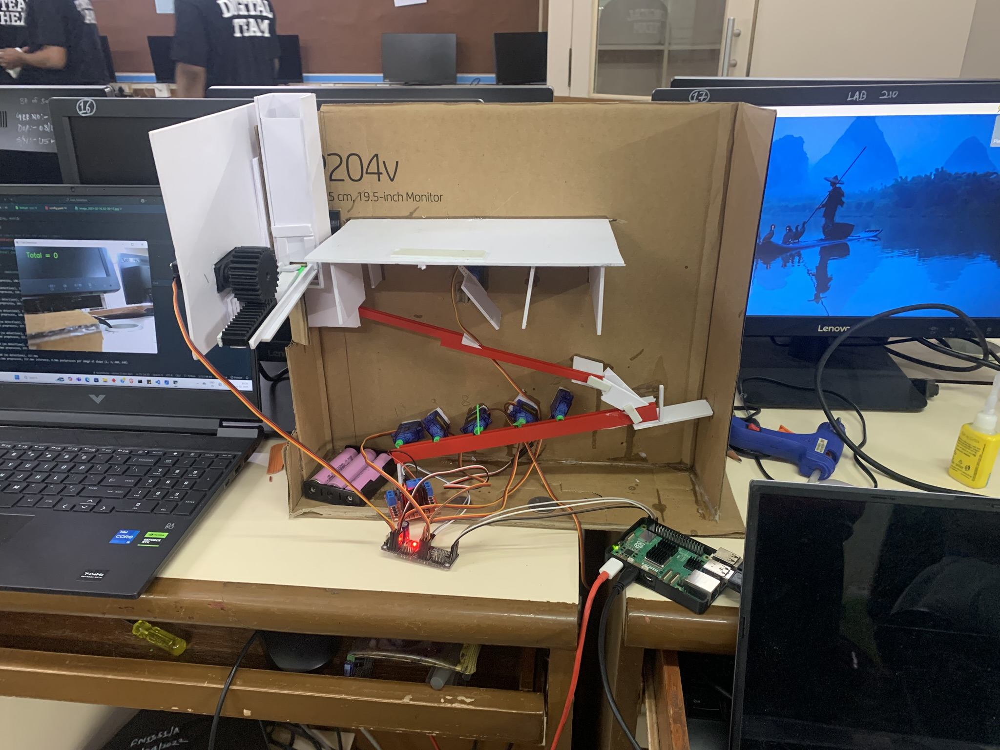
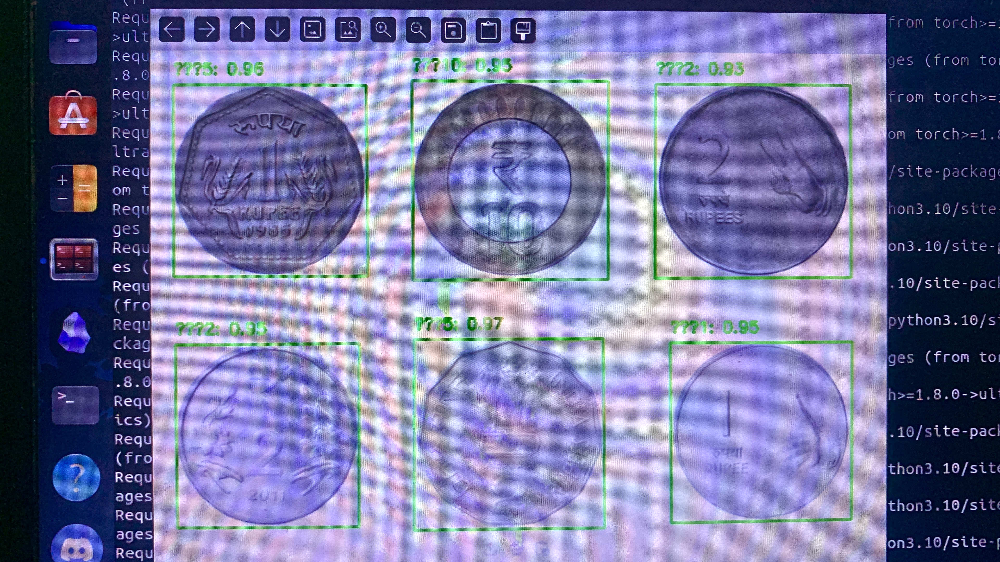
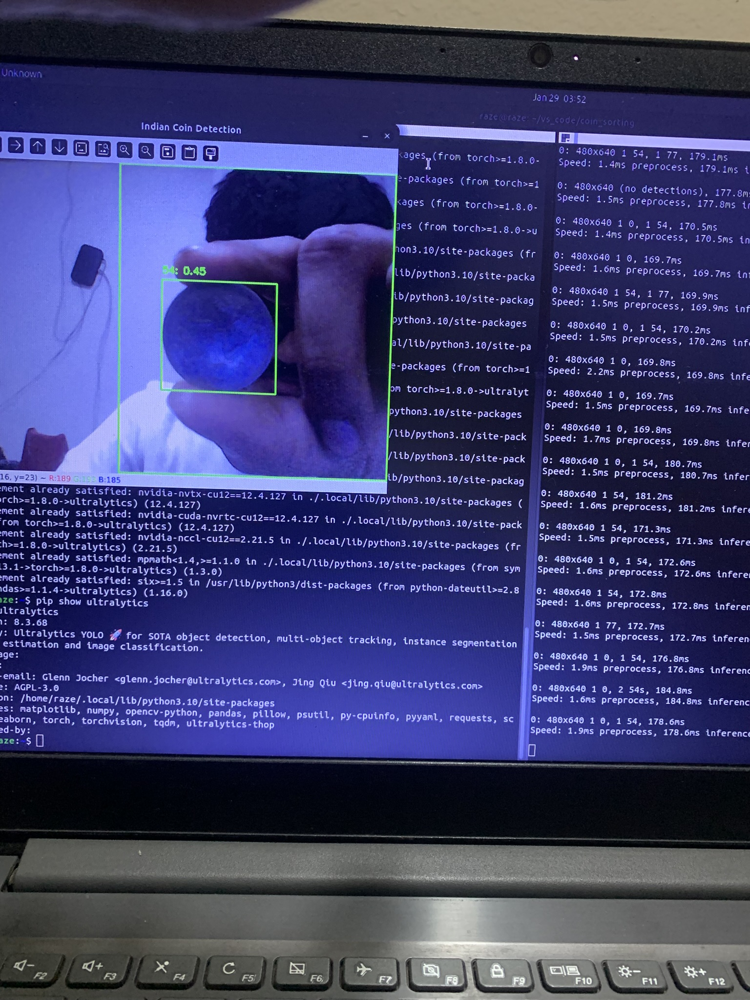

# Coin Sorting and Detection System - VESIT Hardware Hackathon

## Project Overview

This project was developed as a part of a hardware hackathon at Vivekanand Education Society's Institute of Technology (VESIT). It aims to automatically sort and detect different denominations of Indian coins using a combination of custom-designed hardware and machine learning.

We designed a CAD model for the sorting mechanism and trained a machine learning model on a custom-collected dataset of Indian coin images. The system utilizes a Raspberry Pi for image processing and control.

## Features

* **Automated Coin Sorting:** Physical sorting of coins based on diameter.
* **Coin Denomination Detection:** Image-based classification of coin denominations using a trained machine learning model.
* **Raspberry Pi Integration:** Utilizes a Raspberry Pi for image processing and system control.
* **Custom Dataset:** Trained on a dataset of Indian coin images collected by the team.
* **Custom CAD Design:** Designed and fabricated a custom CAD model for the sorting mechanism.

## Hardware Components

* Raspberry Pi
* Camera Module (for image capture)
* Sorting Mechanism (custom-designed and fabricated)
* Servo motors (for sorting control)
* Various electronic components (wires, resistors, etc.)

## Software Components

* Python (for image processing and control)
* OpenCV (for image processing)
* pytorch (for machine learning model)
* Raspbian OS (on Raspberry Pi)

## Hardware Setup

## Coin Detection using OpenCV

## Installation and Usage

1.  **Hardware Setup:** Assemble the hardware components as per the designed CAD model and circuit diagram.
2.  **Software Setup:**
    * Install Raspbian OS on the Raspberry Pi.
    * Install necessary Python libraries (OpenCV, etc.).
    * Copy the Python scripts and trained model to the Raspberry Pi.
3.  **Dataset:** Place the dataset of coin images in the appropriate directory.
4.  **Running the System:** Execute the Python script on the Raspberry Pi. The system will capture images, detect coin denominations, and control the sorting mechanism.

## Project Output

## Team Members

* Kartikey Pathak
* Piyush Patle
* Shaurya Rane
* Vishal Mutha

## Future Enhancements

* Improve the accuracy of the machine learning model.
* Implement a user interface for easier control and monitoring.
* Add a coin counting feature.
* Optimize the hardware design for better efficiency.
* Add a display to show the detected coin values.

## Acknowledgments

* Vivekanand Education Society's Institute of Technology (VESIT) for organizing the hardware hackathon.
